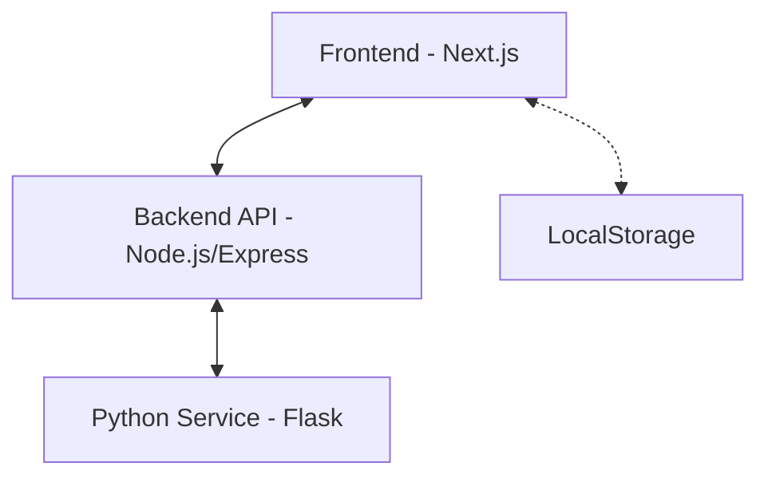
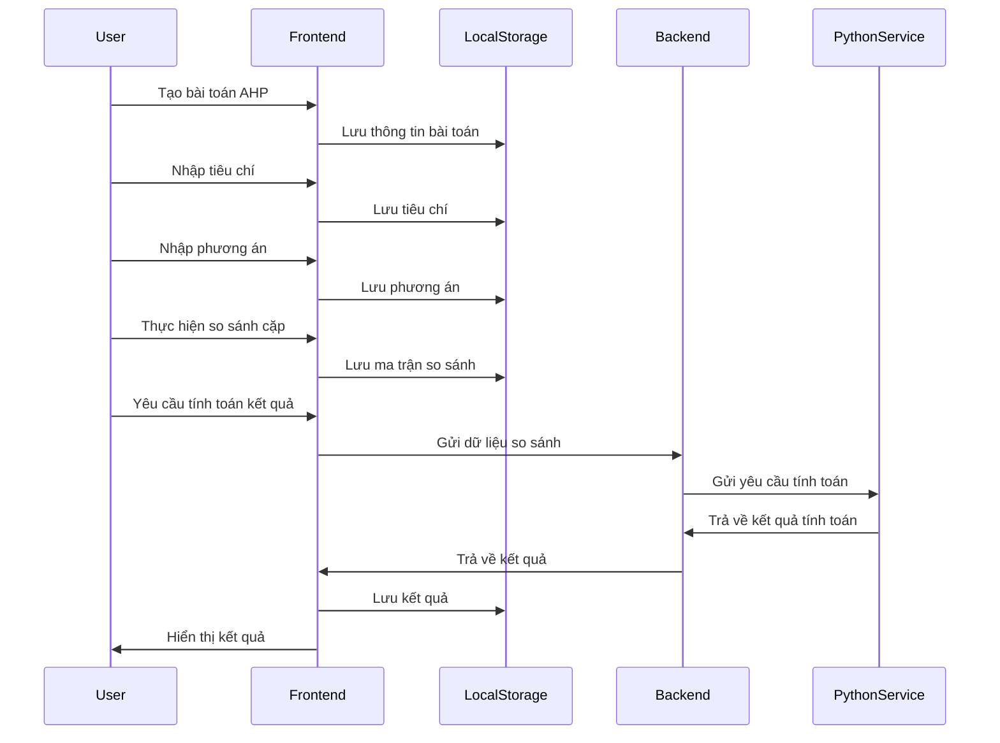

# Mô Hình Hệ Thống

## Kiến Trúc Tổng Thể
Ứng dụng AHP được xây dựng theo mô hình kiến trúc phân tầng với 3 thành phần chính:



1. **Frontend (Next.js)**: Xử lý giao diện người dùng và tương tác
2. **Backend API (Node.js/Express)**: Xử lý các yêu cầu từ frontend và giao tiếp với Python Service
3. **Python Service (Flask)**: Thực hiện tính toán AHP
4. **LocalStorage**: Lưu trữ dữ liệu tạm thời của người dùng

## Luồng Dữ Liệu


## Mô Hình Dữ Liệu
Dữ liệu trong ứng dụng được tổ chức theo cấu trúc sau:

```typescript
// Cấu trúc bài toán AHP
interface AHPProblem {
  id: string;
  name: string;
  description: string;
  mode: 'student-expense' | 'custom' | 'ai-assisted';
  criteria: Criterion[];
  alternatives: Alternative[];
  comparisons: {
    criteria: number[][];
    alternatives: number[][][];
  };
  results?: AHPResults;
}

// Tiêu chí
interface Criterion {
  id: string;
  name: string;
  description: string;
}

// Phương án
interface Alternative {
  id: string;
  name: string;
  description: string;
}

// Kết quả AHP
interface AHPResults {
  criteria_weights: number[];
  criteria_consistency: {
    lambda_max: number;
    ci: number;
    ri: number;
    cr: number;
    is_consistent: number;
  };
  alternatives_weights: number[][];
  alternatives_consistency: any[];
  final_scores: number[];
  criteria_names?: string[];
  alternative_names?: string[];
}
```

## Mẫu Thiết Kế
1. **Mẫu Trạng Thái (State Pattern)**: Sử dụng để quản lý các bước trong quy trình AHP
2. **Mẫu Chiến Lược (Strategy Pattern)**: Áp dụng cho các phương pháp tính toán khác nhau
3. **Mẫu Quan sát (Observer Pattern)**: Sử dụng trong cơ chế cập nhật UI khi dữ liệu thay đổi
4. **Mẫu Đơn Lẻ (Singleton Pattern)**: Áp dụng cho các dịch vụ chia sẻ

## Các Thành Phần Chính
1. **Quản lý Trạng thái**: Sử dụng React Context và useState để quản lý trạng thái ứng dụng
2. **Xử lý Biểu mẫu**: Sử dụng controlled components để xử lý nhập liệu
3. **Điều hướng**: Sử dụng Next.js App Router để quản lý điều hướng
4. **Tính toán AHP**: Sử dụng Flask API để thực hiện các tính toán phức tạp
5. **Hiển thị Kết quả**: Sử dụng các thư viện biểu đồ để hiển thị kết quả trực quan